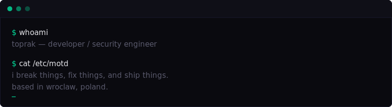
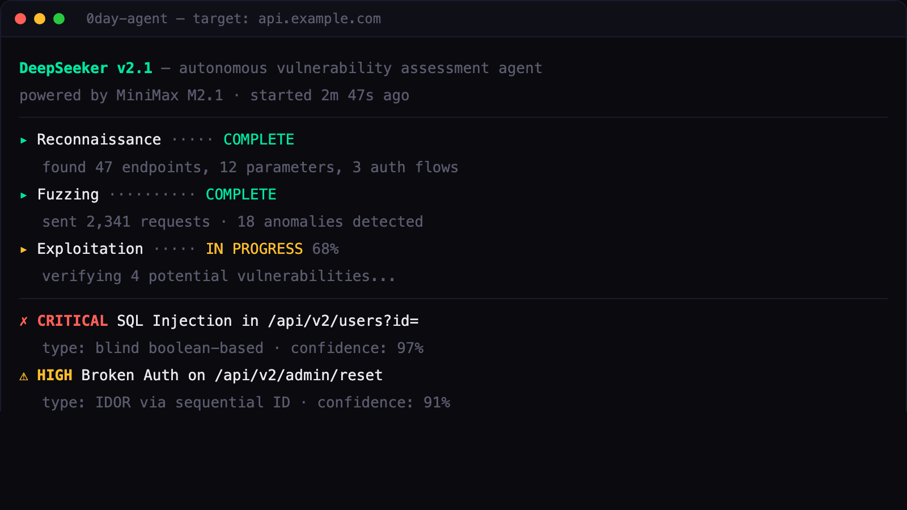
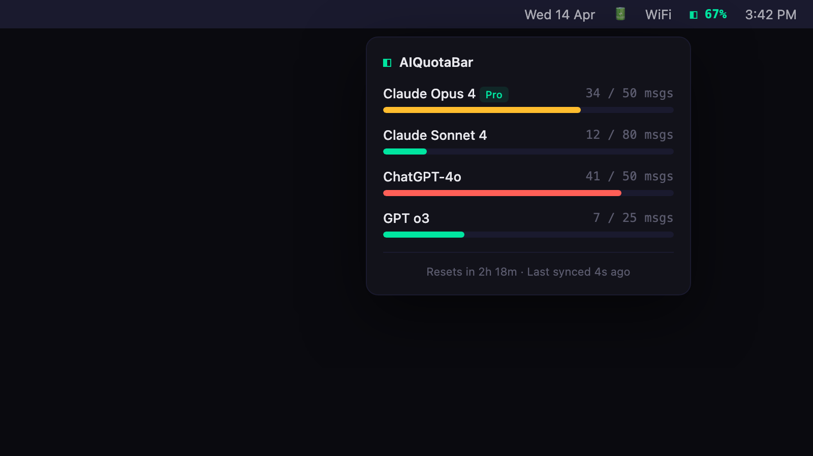
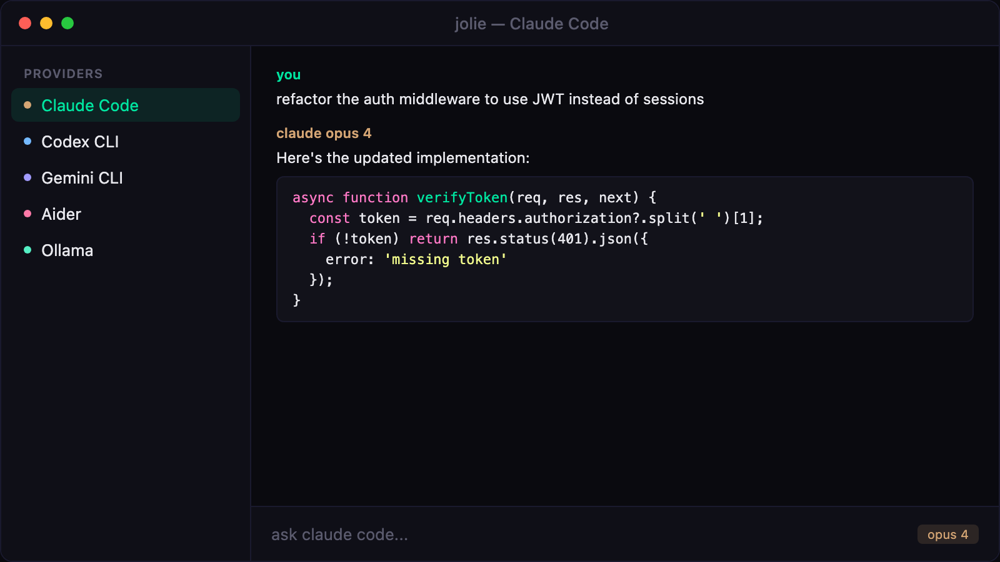
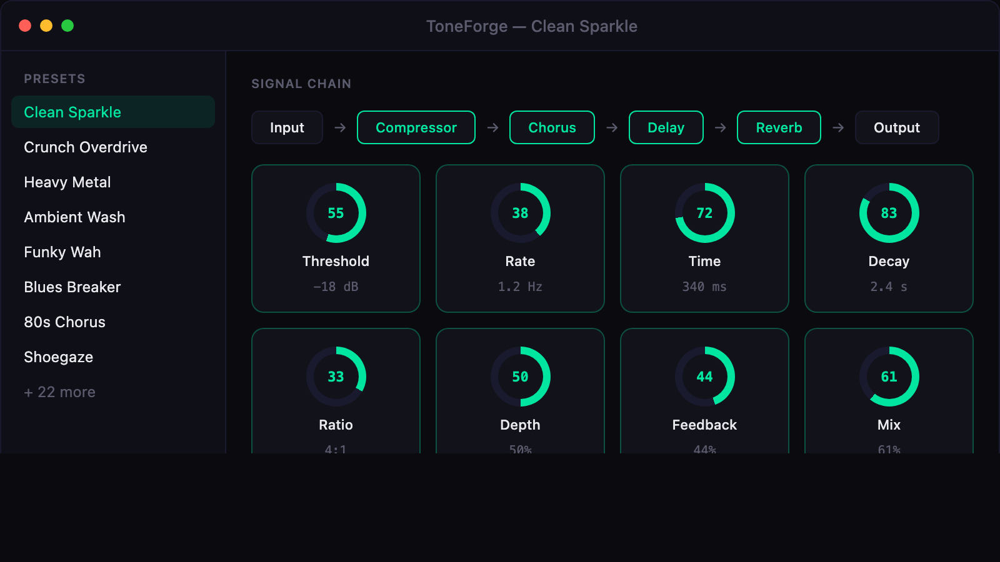
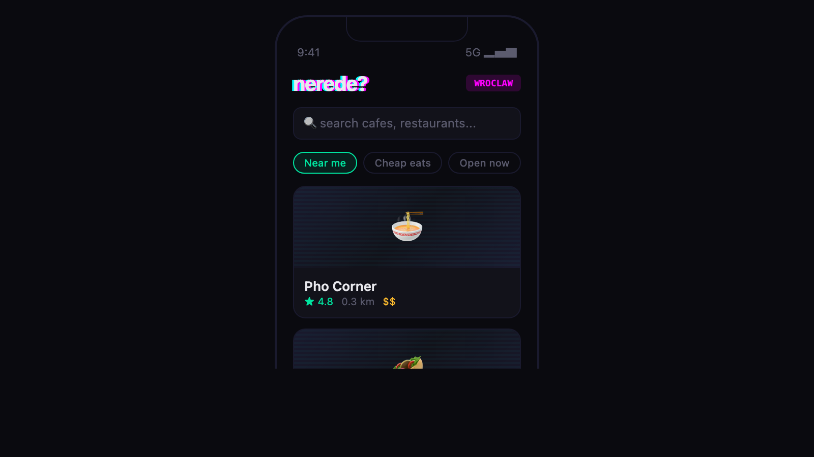
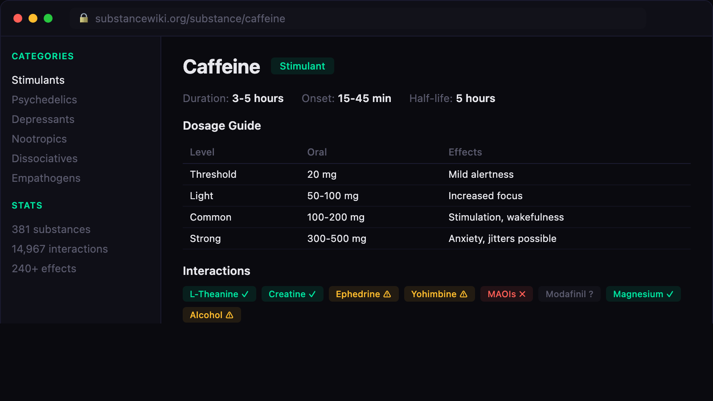
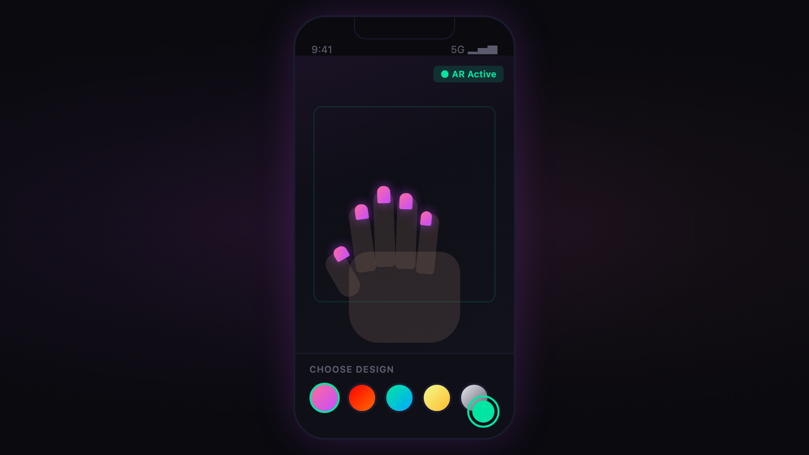

<br/>

22, Wrocław. I write code, find bugs in other people's code, and play too much electric guitar. Half my projects are apps I actually ship, half are things I broke on purpose. I like native macOS, AR on phones, DSP, and anything that looks nothing like the thing next to it.

Always between three unfinished ideas. Usually I finish them.

<br/>

### >_ NOW

```
> 0day-agent    finishing the exploit-chain verifier
> jolie         shipping the first beta next month
> toneforge     adding a tube-amp model (for me, honestly)
> hackerone     hunting in fintech targets
> guitar        learning old polish blues riffs, badly
```

<br/>

### >_ PROJECTS

<table>
<tr>
<td width="50%">

<br/>
<strong>0day-agent</strong><br/>
<sub>AI agent that hunts web vulnerabilities on its own. Recon → fuzz → verify.</sub><br/>
<sub>


</sub>
</td>
<td width="50%">
<a href="https://github.com/yagcioglutoprak/AIQuotaBar"></a>
<br/>
<strong><a href="https://github.com/yagcioglutoprak/AIQuotaBar">AIQuotaBar</a></strong><br/>
<sub>macOS menu bar widget for Claude & ChatGPT quota. Was tired of hitting limits mid-session.</sub><br/>
<sub>


</sub>
</td>
</tr>

<tr>
<td width="50%">

<br/>
<strong>jolie</strong><br/>
<sub>Native macOS app. One window for Claude Code, Codex, Gemini, Aider, Ollama.</sub><br/>
<sub>


</sub>
</td>
<td width="50%">

<br/>
<strong>ToneForge</strong><br/>
<sub>Built this for my own guitar setup. 17+ effects, 30 presets, low-latency DSP.</sub><br/>
<sub>


</sub>
</td>
</tr>

<tr>
<td width="50%">

<br/>
<strong>nerede yer?</strong><br/>
<sub>Where do students actually eat in Wrocław? This answers that. Cyberpunk UI.</sub><br/>
<sub>


</sub>
</td>
<td width="50%">

<br/>
<strong>substance wiki</strong><br/>
<sub>Harm-reduction encyclopedia. 381 substances, 14,967 interactions, proper dosage data.</sub><br/>
<sub>


</sub>
</td>
</tr>

<tr>
<td width="50%" colspan="2" align="center">

<br/>
<strong>Nailo</strong><br/>
<sub>iOS app. Point your camera at your hand, try on nail designs in AR.</sub><br/>
<sub>


</sub>
</td>
</tr>
</table>

<br/>

### >_ STACK

**Security** &nbsp;


**AI/ML** &nbsp;


**Native** &nbsp;


**Web** &nbsp;


**Systems** &nbsp;


<br/>

### >_ SECURITY

I hunt bugs on HackerOne. Mostly web and mobile targets, occasionally smart contracts. If your product has an attack surface and you want a second pair of eyes on it, email works.

→ [hackerone.com/toprak_y](https://hackerone.com/toprak_y)

<br/>

### >_ CONTACT

Email is fastest. DMs on Twitter also fine.

```
email      yagcioglutoprak@gmail.com
twitter    @Toprak_MCSG
hackerone  toprak_y
site       toprak.sh
where      Wrocław (CET) · remote is fine
```

<br/>

<p align="center">
  <a href="mailto:yagcioglutoprak@gmail.com"></a>
  &nbsp;
  <a href="https://toprak.sh"></a>
  &nbsp;
  <a href="https://twitter.com/Toprak_MCSG"></a>
  &nbsp;
  <a href="https://hackerone.com/toprak_y"></a>
</p>
