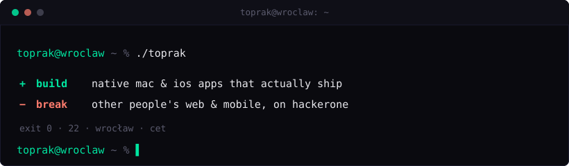

<br/>

Most of what I build started as something that annoyed me. dusty, because CleanMyMac wants a subscription to delete cache files. [AIQuotaBar](https://github.com/yagcioglutoprak/AIQuotaBar), because I kept hitting the wall mid-session with no warning. The security work is the same instinct aimed at other people's software.

Off the clock it is electric guitar, and more chord-recognition code than that hobby strictly requires.

<br/>

### `+` building

**[dusty](https://github.com/yagcioglutoprak/dusty)** &nbsp;·&nbsp; Swift &nbsp;·&nbsp; open source &nbsp;·&nbsp; [](https://github.com/yagcioglutoprak/dusty/stargazers)  
A free CleanMyMac alternative for macOS, built around one refusal: it only ever deletes from a fixed allowlist, and it shows you every path and every byte before it touches anything. No "clean everything" button, and there won't be one. Native, notarized, no Electron, no subscription.  
`brew install --cask yagcioglutoprak/tap/dusty`

**Öğrenci Nerede Yer?** &nbsp;·&nbsp; [iOS beta](https://testflight.apple.com/join/wTukQquP)  
A social dining app for Turkish university students: cheap eats near campus, an Istanbul map full of pins, and swipe-to-match meal buddies. Places are rated on three axes instead of one, because cheap and bad is still bad. On TestFlight now.

**glitch** &nbsp;·&nbsp; private  
An AI pentester, and a bench to watch it think. Point it at something you are allowed to hit and it decides for itself where the soft part is: no checklist, no scanner signatures, nobody telling it which parameter to try. It keeps itself on a leash, too. Wander out of scope and the agent eats a `403` from its own tooling before the target ever hears about it. More when it ships.

### `−` breaking

I hunt bugs on **[HackerOne](https://hackerone.com/toprak_y)**: mostly web and mobile targets, the occasional smart contract. If your product has an attack surface and you'd like a second pair of eyes on it, email me.

<br/>

```
email      yagcioglutoprak@gmail.com
site       toprak.sh
twitter    @Toprak_MCSG
hackerone  toprak_y
where      Wrocław · CET · remote is fine
```

Email is fastest. Twitter DMs are open too.
