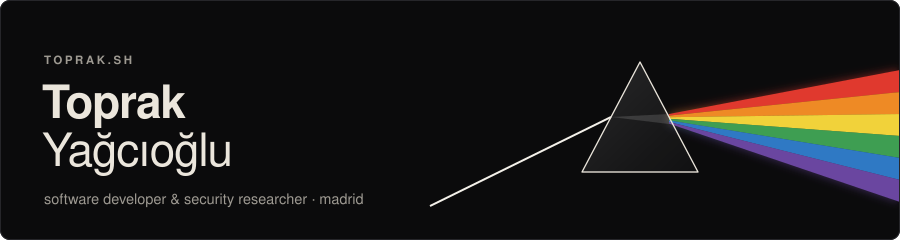

I build apps for iPhone and Mac. On the side I look for security holes in other people’s backends. Twice I found real ones.

### Building

**Öğrenci Nerede Yer** · iOS · out now  
Where students in Istanbul eat, rated by students on taste, price and vibe.  

**[Dusty](https://github.com/yagcioglutoprak/dusty)** · macOS · open source ·   
A Mac cleaner that shows you everything before it deletes anything.  
`brew install --cask yagcioglutoprak/tap/dusty`

**Glitch** · macOS · private alpha  
My own pentest tool: an HTTPS proxy with a coding agent inside, and its own tooling keeps it in scope.

**[AIQuotaBar](https://github.com/yagcioglutoprak/AIQuotaBar)** · macOS  
Your AI usage limits, live in the menu bar, so you stop hitting the wall mid-session.

### Breaking

Found, reported and fixed: one bug at Amazon, one at Trendyol. More on [HackerOne](https://hackerone.com/toprak_y).

### Say hello

[yagcioglutoprak@gmail.com](mailto:yagcioglutoprak@gmail.com) · [toprak.sh](https://toprak.sh) · [LinkedIn](https://www.linkedin.com/in/toprak-yagcioglu-29b23215b/) · [X](https://x.com/Toprak_MCSG) · Madrid
